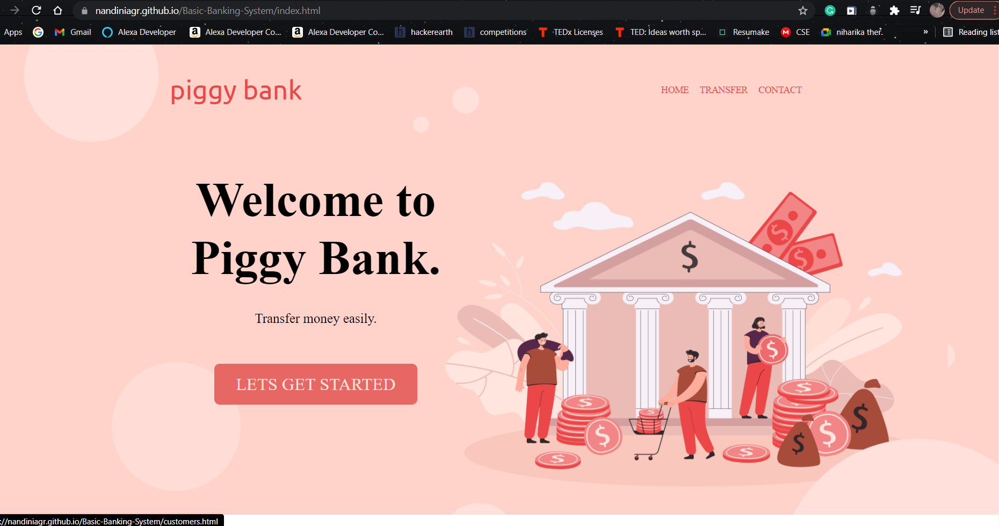
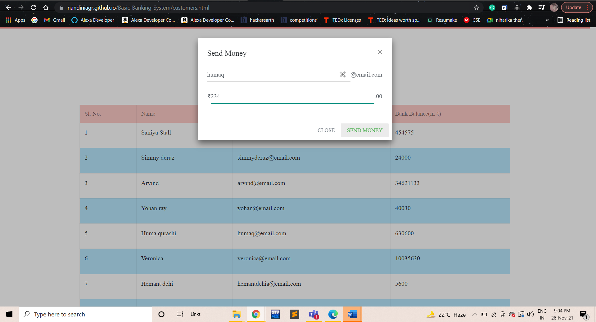
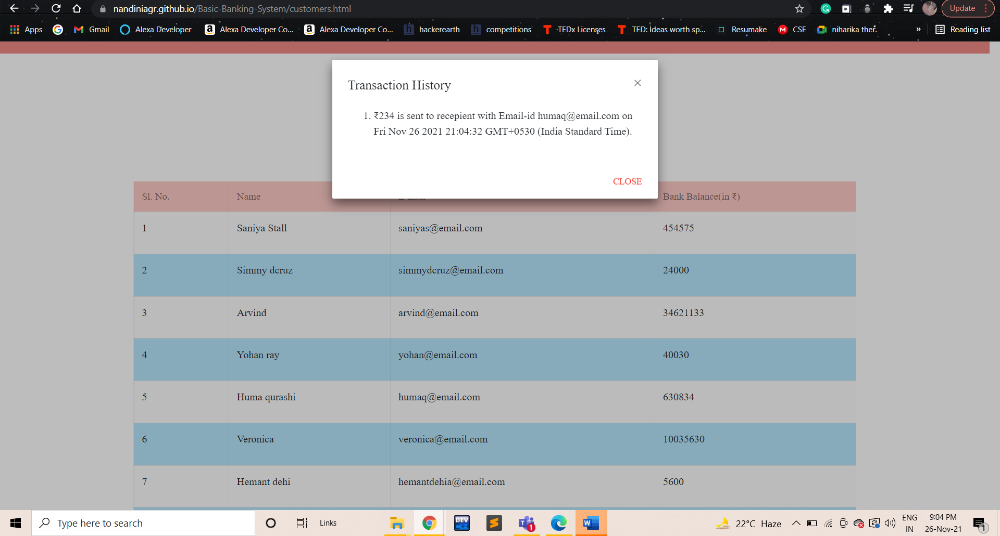

# Basic-Banking-System

<!-- PROJECT SHIELDS -->
<!--
*** I'm using markdown "reference style" links for readability.
*** Reference links are enclosed in brackets [ ] instead of parentheses ( ).
*** See the bottom of this document for the declaration of the reference variables
*** for contributors-url, forks-url, etc. This is an optional, concise syntax you may use.
*** https://www.markdownguide.org/basic-syntax/#reference-style-links
-->

[![LinkedIn][linkedin-shield]](https://www.linkedin.com/in/nandini-agrawal-454250188/)

<!-- PROJECT LOGO -->
 

  

  

    - A Basic Banking System
     
     <a href="https://github.com/Nandiniagr/Basic-Banking-System"><strong>Explore the docs »</strong></a>
     
     
    <a href="https://lnkd.in/efh2-n7N">Visit website</a>
    ·
    <a href="https://github.com/Nandiniagr/Basic-Banking-System/issues">Report Bug</a>
    ·
    <a href="https://github.com/Nandiniagr/Basic-Banking-System/issues">Request Feature</a>
  

<!-- ABOUT THE PROJECT -->
## About The Project

<!-- [![Product Name Screen Shot][product-screenshot]](https://example.com) -->

(<a href="#top">back to top</a>)

### Built With

* Javascript
* HTML
* CSS

(<a href="#top">back to top</a>)

<!-- USAGE EXAMPLES -->
## Usage

A banking web application which can do the following functions:
<ul>
  <li> Transfer Money </li>
  <li> View Transfer History </li>
  <li> View Customers </li>
  
</ul>

(<a href="#top">back to top</a>)

<!-- CONTACT -->
## Contact

Your Name - nandiniagrawal2001@gmail.com

Project Link: [https://github.com/Nandiniagr/Basic-Banking-System](https://github.com/Nandiniagr/Basic-Banking-System)

(<a href="#top">back to top</a>)

<!-- ACKNOWLEDGMENTS -->
## Author

* [https://github.com/Nandiniagr](https://github.com/Nandiniagr)

(<a href="#top">back to top</a>)

<!-- More images of application

 -->
  
<!-- MARKDOWN LINKS & IMAGES -->
<!-- https://www.markdownguide.org/basic-syntax/#reference-style-links -->
[contributors-shield]: https://img.shields.io/github/contributors/github_username/repo_name.svg?style=for-the-badge
[contributors-url]: https://github.com/github_username/repo_name/graphs/contributors
[forks-shield]: https://img.shields.io/github/forks/github_username/repo_name.svg?style=for-the-badge
[forks-url]: https://github.com/github_username/repo_name/network/members
[stars-shield]: https://img.shields.io/github/stars/github_username/repo_name.svg?style=for-the-badge
[stars-url]: https://github.com/github_username/repo_name/stargazers
[issues-shield]: https://img.shields.io/github/issues/github_username/repo_name.svg?style=for-the-badge
[issues-url]: https://github.com/github_username/repo_name/issues
[license-shield]: https://img.shields.io/github/license/github_username/repo_name.svg?style=for-the-badge
[license-url]: https://github.com/github_username/repo_name/blob/master/LICENSE.txt
[linkedin-shield]: https://img.shields.io/badge/-LinkedIn-black.svg?style=for-the-badge&logo=linkedin&colorB=555
[linkedin-url]: https://linkedin.com/in/linkedin_username
[product-screenshot]: images/screenshot.png
